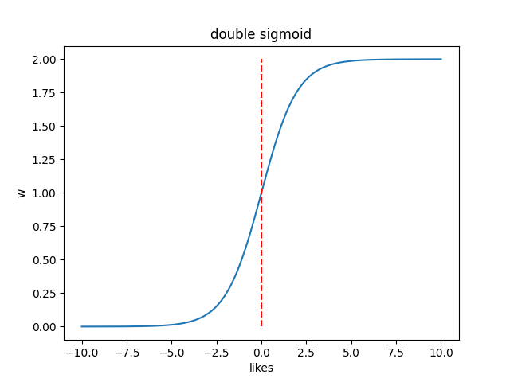
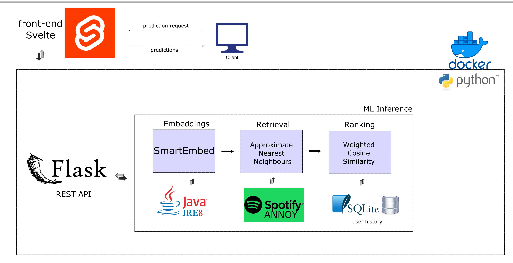

# ⟠ SCANN ⟠ 
### Smart Contract Approximate Nearest Neighbours

SCANN is a smart contract similarity search service. Given a smart contract, it searches from a DB with 750K+ [open-sourced](https://github.com/tintinweb/smart-contract-sanctuary-ethereum) contracts and retrieves the 5 most similar contracts.

## Installation ⚡️ 

Requirements are docker and npm (version `9.5.1` tested). Open up a terminal, and in the desired location run:
```bash
git clone https://github.com/pablo-martin/SCANN.git
cd SCANN/
bash build_frontend.sh # additionally installs pnmp
```
It will prompt you 3 times, the first select "Skeleton Project", the other 2 just hit enter on the first option. Continue:

```bash
docker build -t scann_docker . # go make a coffee ~5 mins
docker run -p 5000:5000 -d scann_docker
cd scann_front/
pnpm run dev
```

You will get output similar to this:
```bash
  VITE v4.1.4  ready in 1181 ms

  ➜  Local:   http://localhost:5173/
  ➜  Network: use --host to expose
  ➜  press h to show help
```
Open a browser and go to localhost with whatever port number is shown. When you're done don't forget to stop your container since it's ~4.5GB 
```bash
docker container ls # to find the name of your container
docker container stop <container-name>
```

## ML - Smart Contract Search

Finding similar smart contracts is a search problem, which is classically split into a retrieval and a ranking phase. In this approach, SCANN uses "Embedding Based Retrieval" (EBR) outlined below.

### Embeddings
- Take the smart contract submitted by the user and encode it as a fixed dimension vector representing semantic meaning. SCANN uses [SmartEmbed](https://github.com/pablo-martin/SmartEmbed) (forked from [here](https://github.com/beyondacm/SmartEmbed)). It works by parsing the grammar syntax of the contract using the [ANTLR4](https://www.antlr.org/) project. The structural parsing yields word streams, on which traditional word embeddings (based on ngrams) are built. This outputs a fixed-dimension embedding that can be used to compare the similarity of 2 contracts via distance or norm-based metrics like cosine similarity.
### Retrieval
SCANN uses approximate nearest neighbours for retrieving top 5 recommendations. It uses the [SimHash](https://en.wikipedia.org/wiki/SimHash) algorithm to build a random projection tree. It builds the inverted index through a series of yes/no questions from tree structures, which can be visualized as Vornoi cells. It has a tradeoff in accuracy for speed/memory and was developed for large datasets. For implementation I considered different alternatives explained below.

- Chose to use Spotify's [ANNOY](https://github.com/spotify/annoy) library for implementation, using "dot" product as search metric. It was fast, and installation was straightforward. 
- Also explored [FAISS](https://github.com/facebookresearch/faiss) which is a similar implementation from Facebook FAIR. However, it needed some BLAS C++ libraries that may not have worked on a Docker image
- Initially thought about using ElasticSearch, since I have the most experience with this tool, and which also offers [ANN](https://www.elastic.co/blog/introducing-approximate-nearest-neighbor-search-in-elasticsearch-8-0) capabilities and is a standard in the industry. However, again I thought it may not run well in a container or will have forced me to use multiple containers and docker-compose

### Ranking
SCANN ranks suggestions by highest weighted cosine similarity to the input embedding. It does this by taking the following approach:
- It retrieves K*4 entries from the index, in our case 20, with their associated cosine similarity to the input embedding
- remember that these are not exact given the accuracy tradeoff taken by ANN
- The like/dislike contract history for the input embedding is pulled up (if it's been seen before). This history stores a mapping of contract_id -> like (e.g. `{456: -2, 55: 1, 5897:1}`). 
- Given the 20 recommendations given by the retrieval stage, it finds if any of them are in the contract history. They are transformed via a double sigmoid function and become the weights of their respective cosine similarities. Look at Online Learning section below for more details
- The weights are multiplied with their respective cosine similarities, sorted, and then the top 5 results are returned
- the reason we take 20 examples from the retrieval phase is because this will allow contracts out of this range to "sneak" into the top 5 if they have been given enough likes in the past

This system is a great starting point since it's simple, and easy to implement. A more mature systems might include:
- contextual bandits (Thompson sampling)
- [RankNet](https://www.microsoft.com/en-us/research/wp-content/uploads/2005/08/icml_ranking.pdf) or more modern [variants](https://www.microsoft.com/en-us/research/uploads/prod/2016/02/MSR-TR-2010-82.pdf) can be implemented quickly as well 

### Online Learning
The smart contract repository we used had many contracts (+1M contract, although 750K+ unique ones), but it did not have any labels regarding similarity. In other words, there was no way to know which contracts are similar to what other contracts. Having a solidity developer look through the half a trillion combinations is unfeasible. So how do we know that are recommendations are good? For this reason, we implemented a simple online learning system based on "likes" and "dislikes".
- when a user clicks on a recommendation, it has the ability to either give it a "like" or "dislike", signaling whether the suggestion was good or not
- that relationship is stored by the system, and when that contract is searched again, the cosine similarity is weighed by the like score passed through the following sigmoid variation:  
$$\frac{2} {1 + e^-\Theta^Tx }$$ 
<p align="center">
  
</p>

- if there is no like history, the cosine similarity is multiplied by 1, so it's the same  
- 1 like will multiply it by 1.44 (a strong increase)
- 1 dislike will multiply it by 0.66 (a strong decrease)
- the amount of likes/dislikes is not bounded, however, the double sigmoid function converges to near 0 and near 2 very quickly
- since traffic will be low (internal tool), likes/dislikes are taken as strong signals to push the recommendations significantly 
- Note: in the current implemenation, I forgot to "symmetrically" add the data. In other words, when a given smart contract x gets a like in relationship to contract y, it should be stored in both the history of x and y. In the current implementation, it's only stored in the contract history of x.

### Offline Experiments
Assesing the quality of a search system is hard problem. Are the requests served actually similar? The online learning component can be a good feedback system, however, it's limited to the amount of use it gets, and if the system is not good to start with it won't have very much use at all! There are a series of offline experiments that could share light into the quality of the model, and as an interim to the next iteration I would carry out the following experiments
#### 1. Smart Contract Synthetic Data
Design experiment where we take a random sample of smart contracts from DB (~1K), and synthetically change in non-meaningful ways. For example, programatically introduce code comments, or change variable names, and compute the embeddings. Take another random sample (~1K) of contracts from the DB and compute embeddings. 
- We have 3 samples: original random sample, the synthetically generated sample from it, and a third random sample
- Compute centroid of each sample and measure distance of synthetic sample, and second random sample
- Compare distribution of distances via t-test. We expect the synthetically generated samples to be much closer than the random sample if the embeddings are meaningful  

#### 2. Clustering ERC20 vs ERC721
I have limited knowledge of smart contract programming. However, I do know that there are different standards for fungible (ERC20) vs non-fungible (ERC721, NFTs) contracts. I would expect these different standards to be represented in the embedding. 
- Find a way to label ERC20 vs ERC721 contracts and get a good sample from each (~20K)
- Perform various clustering techniques like tSNE for visualization to confirm separation
- Build a classifier to label them. The performance of the classifier can be used as a proxy for the quality of the embeddings  

#### 3. ANN vs Exact Neighbours - tuning the index
Once the system has enough interaction, we can query the DB and find all the contracts that were searched and their respective recommendations. Since the index uses *approximate* nearest neighbours, it won't find the exact closest matches given the embedding. It has a trade-off for speed vs accuracy via the k_search parameter. We can tune this parameter by:
- extracting contracts searched and recommendations given
- for each smart contract, find the *exact* 5 nearest neighbours offline
- this is not done online because of latency concerns
- compare the given vs actual ranking, and tune k_search parameter to optimize for accuracy, whilst maintaing latency to the desired levels
- alternatively, experiment with n_trees parameter tradeoff of memory vs accuracy. Investigate what are the real memory limitations of deployment and tune that variable according to the memory vs accuracy that achieves the best balance for solving the business problem.

### Monitoring
Monitoring the predictions of an ML system in the wild is just as critical as the training process. It's well known that the quality of ML model predictions detoriorates over time as the outside world changes and the training data is no longer representative of the incoming data. There are several things you can monitor from an ML perspective (for a system perspective look at System Design section Batch Process below). 

The key elements of an ML model monitoring system are time windows, alert thresholds, and developing suitable metrics.
- if a given time window is very small, the distributions will be strange since they are built on low volume. This will of course depend on the amount of traffic the system has. For a low-volume service, a daily and weekly time window is appropriate
- thresholds and notifications are an important component of an ML monitoring system. An appropriate method is to start on the cautious side, and set the threshold low. In this scenario, as the ML system is launched, an ML engineer will investigate the alerts in the system very often (and hopefully conclude that there is no major issue). Over time, as trust in the system grows, we can raise the threshold to reduce the number of false positives (and spam).
- suitable metrics: there are out-of-the-box metrics that we can track to measure the performance of the model and determine whether a re-training is suitable. As the system interacts with the users, other custom metrics that are important to track arise, and so it's important to build a modular monitoring system to be able to add new ways of looking at the data. In general, I think it's a good idea to start with a manual process for re-training based on experiments and manual observations from the DS/MLE team. As understanding develops as to how the model behaves, and when it's a good idea to re-train, the re-training process can become automated and triggered by monitoring alarms, with appropriate automated tests. This is a sign of a mature ML system. I find this [doc](https://learn.microsoft.com/en-us/azure/architecture/example-scenario/mlops/mlops-maturity-model) on ML maturity from Microsoft an interesting overview of the MLOps cycle.  

Some initial metrics to track from the ML perspective are:
- Top1, Top3, Top5:
    - average likes. this can be positive or negative number, where positive is good
    - number of clicks: how many of your recommendations are being explored? is this a good or a bad thing?
    - Mean Average Precision (MAP): measure of how many of the top k retrieved documents are relevant
    - Discounted Cumulative Gain (DCG): similar to MAP, but when the user feedback incorporates a "grade" for the suggestion (1-5). This could be iterated upon, since it's not currently supported. 
- Comparing Distributions
    - Given a baseline distribution of these metrics, we can compare incoming metrics by comparing week-over-week distributions via Kolmogorov-Smirnov (KS) distance. KS distance measure the empirical distribution distance and is a good tool to work if your underlying distributions are unknown. Some of the above measures can be modeled via probabilistic processes that are well defined and more appropriate statistical tests could be researched for further iterations. 
From the system side, it's important to track, for the given time windows:
- latency: P50, P90, P99. Figure out what your service-level agreements (SLAs) should be
- tracking latency is key as the system scales, and may trigger a different type of "re-training". It will involve exploration and time profiling of your system, and figuring out which component is not scaling well. For example, in our current system, it might be the DB, and switching to a distributed version running on its own resources could be a possible solution if latency is going up.

## System Design
The system design is a minimal version of all the components a real production environment might have. Each element is modular and can be iterated upon depending on the requirements of the service. The overall implemented design is sketched out in the diagram below, and further planned modifications are described in the following sections. 
<p align="center">
  
</p>
From my use of the system, I computed the following numbers for latency (with N~50):

- `P50`: 696ms
- `P90`: 780ms
- `P99`: 805ms

### FrontEnd
The front-end is the access point between the client and the service. It's built using the [Svelte](https://svelte.dev/docs) toolkit. By following this tutorial I was able to quickly spin up a usable front-end to display my tool. One detail which I would iterate on is that serving the actual smart contract code to display to the user was not feasible in this first iteration because there are ~54GB of data in the smart contract sanctuary. So, when a user wants a smart contract displayed, the service actually fetches it from GitHub, which is not ideal for latency. In the future, I would spin out the DB into a separate container which both the front-end and the back-end could access to fetch and store data.

### Backend (Docker)
The backend is deployed in a Docker container. This includes the ML inference system, the flask API, sqlite3 DB, a Java Runtime Environment (JRE) and all the packages needed to make the inference work. The image is less traditional in the sense that:
- the embedding library requires a Java Runtime Environment (JRE) for the grammar parsing ANTLR4 package
- for this reason, I chose a Java based image, and extended it to have Python
- in a more mature system, perhaps running these services in different containers through [Docker Compose](https://docs.docker.com/compose/) could be a more modular and stable approach

### REST API
- SCANN uses Flask to serve a REST API 
- There is a user session object that is created that keeps tracks of all the likes/clicks of the user and stores them in the DB when a user searches for a new contract.
- Ideally it would store the user session when the browser gets closed as well, but it could be added in a future iteration
- this is not set up for a production environment (no nginx/gunicorn). However, because it's in a Docker container, there are tools like [Dockerize](https://dockerize.io/) which can be used to setup the server outside the container to make it production ready

### ML Inference
There are 3 components in the ML inference component: the embedding, the retrieval and the ranker. The input smart contract is passed sequentially through the 3 components. Each one interacts with different packages and services to produce the data it needs to serve the predictions. More details in the ML section above.

### DB
A database is deployed in the container and serves 2 functions. First, it gives the ranker the user contract history it needs to do the ranking. It also stores the user session so the sytem can learn from it in the future and for monitoring/retraining purposes.

A sqlite3 database was implemented with 2 tables: the user session data, and the smart contract data.
- `session_data`: table stores all the interaction of the users with the system. it's consumed downstream by the model monitoring service in the batch processes. it keeps track of quality of predictions, latency.
- `smart_contracts`: table stores unique identifiers for smart contracts, a hashed representation of their embedding, and in future iterations the embedding itself and potentially the actual text of the code to be able to serve it. I chose not to include those because the DB is currently stored on file, and managing a more capable (perhaps distribued DB like DynamoDB) in a cloud service would be a good improvement, depending on the intended use.

### Batch Processes
A series of batch procceses (not shown in diagram) could be automated via Airflow/Prefect to run nightly. The idea is that they would consume data from the DB to produce model monitoring, system monitoring, and perhaps even automatic model retraining. Given the current implementation, a first iteration could work on direct SQL queries via an ORM, that would produce tables that can be consumed by a graph generation service for monitoring. A potential first approach is outlined below:
- python scripts consumes the user_session table from DB, and computes the metrics described in the monitoring section above for different time windows. Stores the output in a new table in the DB (not built)
- script checks against a config file specifying alert thresholds set by the MLE team
- if any thresholds are breached, inform the team via slack bot
- provide functionality for generating all these plots. a first iteration could be a jupyter notebook that takes in the processed table and uses seaborn/matplotlib for quick visualization in an ad-hoc way. more mature systems I've used in the past include Looker, which consumes data from a DB/Data Warehouse and can generate these plots in a user-friendly UI in the cloud 
#### re-training pipelines
As I talked about in the model monitoring section above, I would first start with a re-training pipeline that is executed in an ad-hoc way, which could mature into an automated re-training process, depending on MLE team judgement. The steps are:
- take existing `smart_contracts` table, and corresponding embeddings from the index, being very careful to preserve the contract_id the same. This step is very important because user feedback is very valuable and changing the existing indexes would make it difficult to map back to the relationships that are already stored. This matrix is sparse (mostly 0s), and growing it preserves the current information without a problem, as long as it's appended. Note that this matrix is not actually stored since it's ~O(n^2), where n is the number of contracts. An efficient, double-lookup data structure holds that information.
- Append new (previously unseen) embeddings with new contract_ids to DB. 
- Train index from new DB. Deploy both files to same location. 
- Training for ~1M entries is still very fast, however, if this became an automatic re-training process, some tests for latency would be necessary. A hyper-parameter search could be done over the space of n_trees, but keeping latency below a given threshold. This process would mature from the ad-hoc re-training process. An additional suite of automated tests could be generated from the offline experiments proposed above. 
- As running the ad-hoc pipeline manually becomes routine (and a hassle!) for the ML team, that's a good signal to automate the process! However, starting with an automatic system is risky, as usually a suite of offline experiments and understanding of the model must be generated before deployment. 
